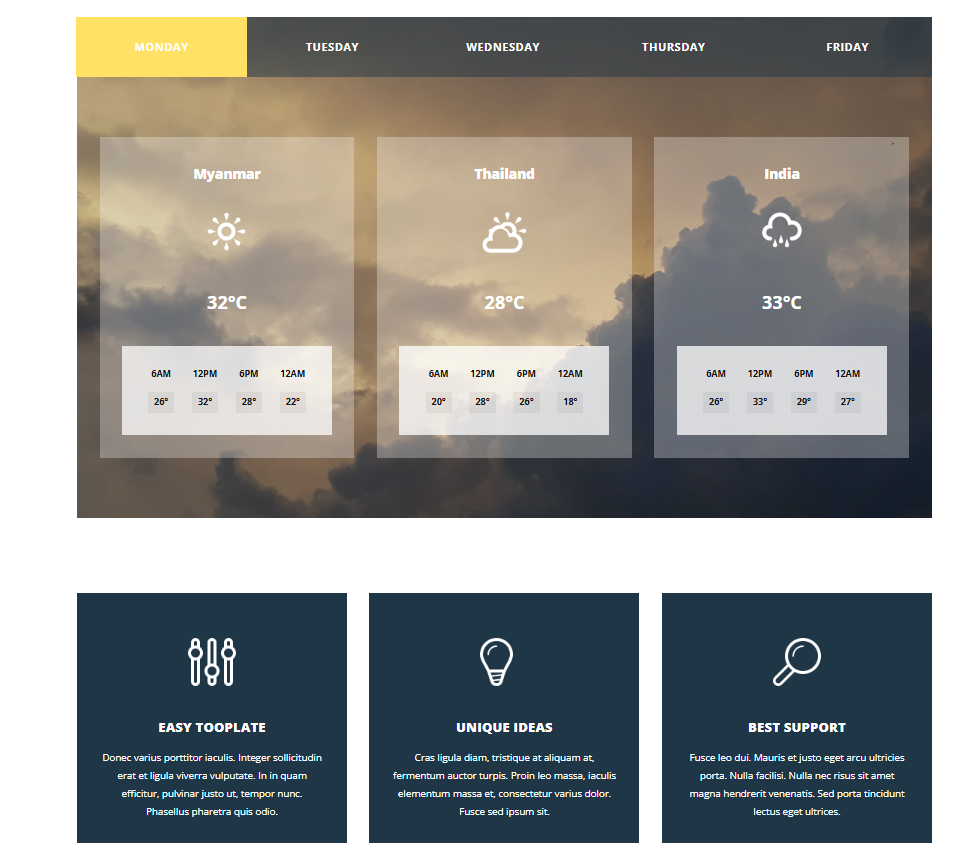

# ✈️ Flight Booking Website

A **responsive, interactive, and feature-rich flight booking website** built using **HTML**, **CSS**, and **JavaScript**. This project simulates the user experience of booking flights online, complete with intuitive date pickers, dynamic form validation, responsive design, and additional features like weather and temperature display.

---

## 🎯 Objective

The goal of this project is to simulate a professional-grade flight booking experience. This frontend project showcases how multiple UI components and real-world interactions (like date selection, location-based temperature display, and dynamic pricing) can be integrated into a clean and responsive layout.

---

## ✨ Key Features

- ✅ **Fully responsive layout** that adapts across mobile, tablet, and desktop
- 📅 **Interactive date pickers** for selecting departure and return flights
- ✈️ **Flight search form** with input fields for destination, origin, number of passengers, and class type
- 🎨 **Modern design** with animations, transitions, and user-friendly interface
- 🛂 **Passenger form** validation with visual feedback
- 💼 Option to select **one-way** or **round-trip** bookings

---

## 🛠️ Technologies Used

- **HTML5** – Markup for webpage structure  
- **CSS3** – Styling and layout  
- **JavaScript (ES6)** – Form logic, validation, and dynamic interactivity  
- **Media Queries** – For responsive behavior across devices  

---

## 🖼️ Screenshots

---

## 🚀 Getting Started

### 🔧 Installation

1. Clone the repository:

   git clone https://github.com/your-username/flight-booking-website.git

2. Navigate to the project folder:

    cd "Online Tour Guide"

📂 Folder Structure

flight-booking-website/

    ├── home.html         
    ├── contact.html           
    ├── css   
        ├── style.css       
    ├── js
        ├── script.js              
    ├── assets/
    │   ├── home.png
    │   ├── booking.png
    │   └── confirmation.png
    └── README.md

📈 Future Improvements
🌐 Integrate real-time weather APIs (like OpenWeatherMap) for live temperature data

🔐 Add user authentication (login/signup)

💳 Payment gateway simulation

📅 Dynamic calendar with blackout dates or holiday highlights

📊 Add price prediction or trends

✅ Live Demo

Author : Bishnu Prasad Sahu